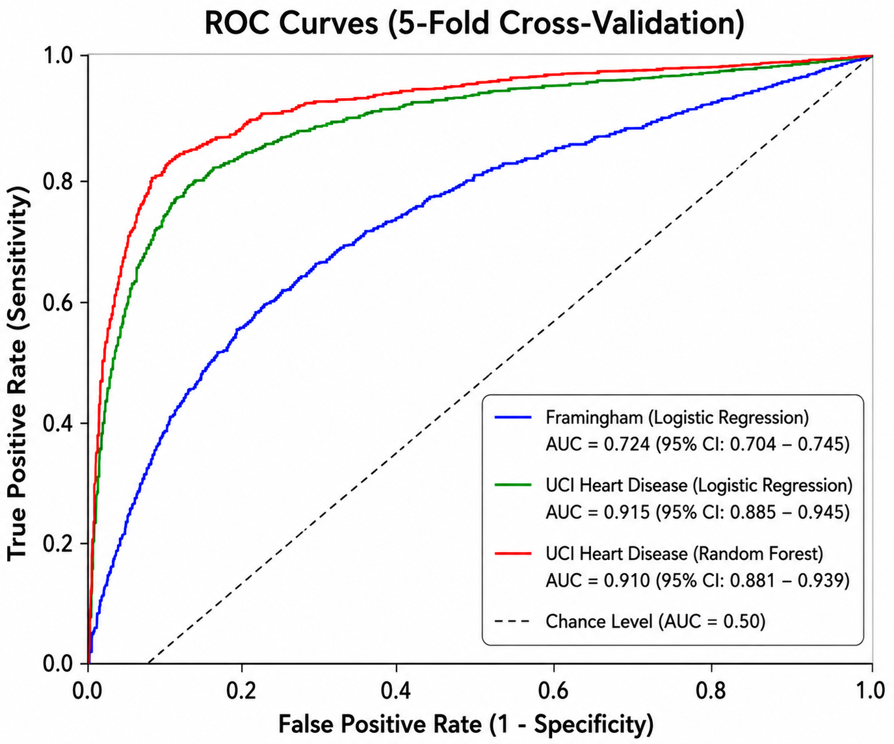
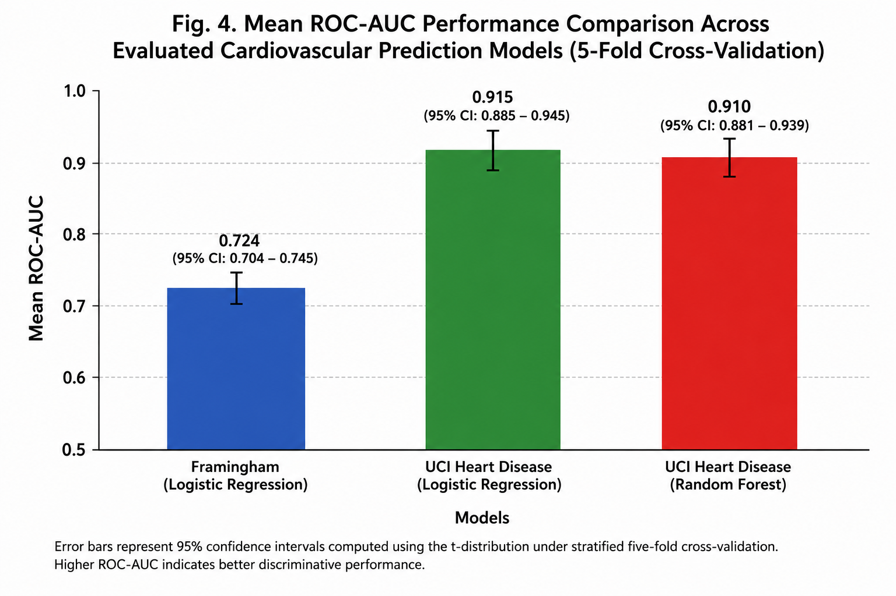
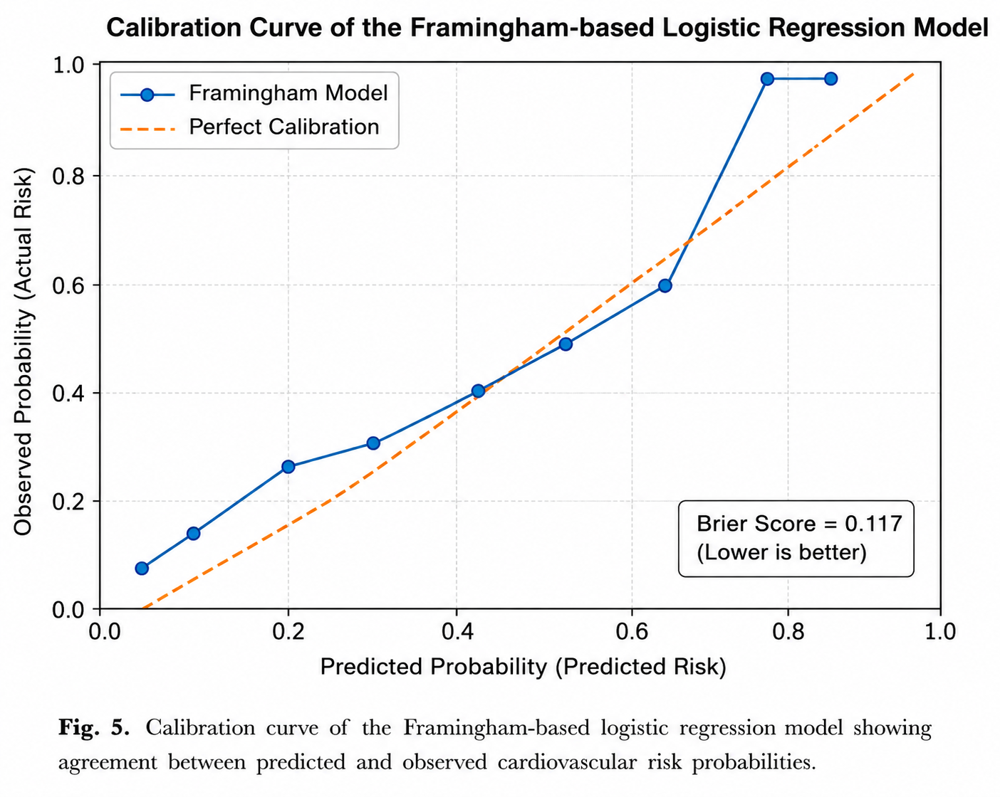
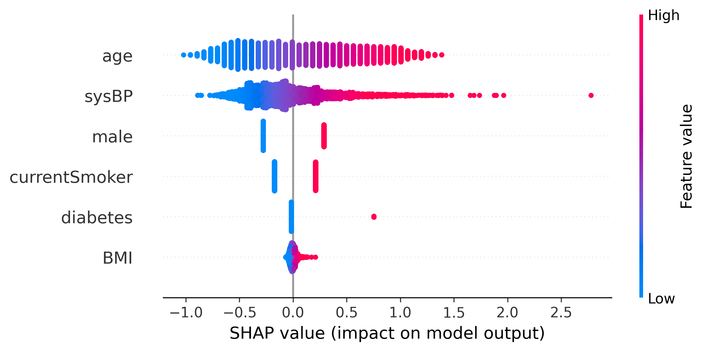
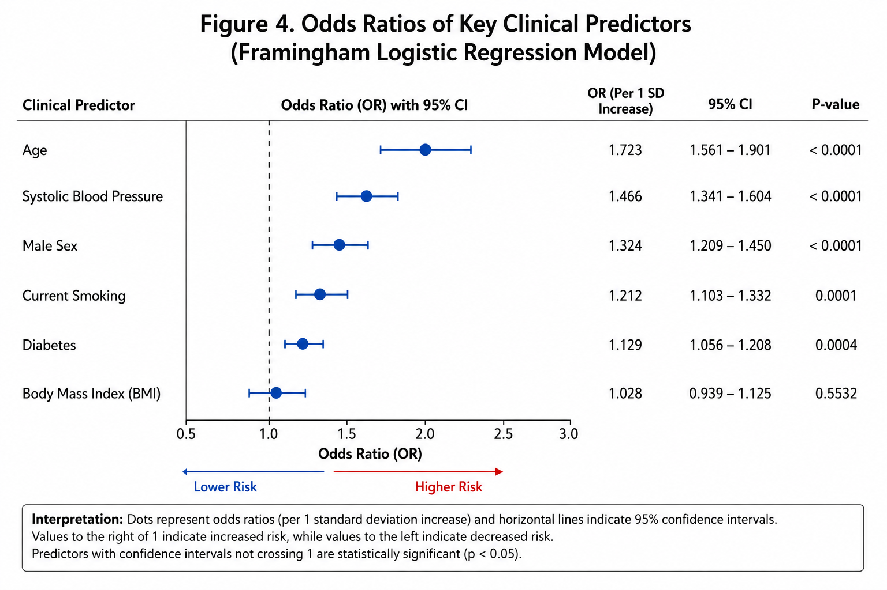

# Explainable Cardiovascular Risk Prediction

## Overview

This repository contains the implementation accompanying the research paper:

**"An Explainable and Clinically Interpretable Machine Learning Framework for Ethical Cardiovascular Risk Prediction"**

The objective of this project is to develop transparent and clinically interpretable machine learning models for cardiovascular disease (CVD) risk prediction. The work emphasizes explainability, calibration, fairness evaluation, external validation, and ethical communication of prediction results.

---

## Repository Structure

```
Explainable-Cardiovascular-Risk-Prediction/
│
├── paper.pdf
├── README.md
├── LICENSE
├── requirements.txt
│
├── framingham_basic_model.py
├── uci_model.py
├── external_validation.py
│
└── figures/
      ├── ROC_Curves.png
      ├── Mean_ROC-AUC.png
      ├── Calibration_Curve.png
      ├── SHAP_Framingham.png
      └── Odds_Ratios.png
```

---

## Features

- Logistic Regression model using the Framingham Heart Study dataset
- Logistic Regression and Random Forest comparison using the UCI Heart Disease dataset
- External validation using the Kaggle Cardiovascular Disease dataset
- SHAP explainability analysis
- Calibration analysis using calibration curves and Brier Score
- Fairness analysis across male and female subgroups
- Odds Ratio estimation with 95% confidence intervals
- Ethical and clinically interpretable risk explanations

---

## Installation

Clone the repository:

```bash
git clone https://github.com/YOUR_USERNAME/Explainable-Cardiovascular-Risk-Prediction.git
```

Move into the project directory:

```bash
cd Explainable-Cardiovascular-Risk-Prediction
```

Install the required packages:

```bash
pip install -r requirements.txt
```

---

## Required Packages

The project uses the following Python libraries:

- numpy
- pandas
- scikit-learn
- scipy
- matplotlib
- statsmodels
- joblib
- shap

---

## Datasets

This project uses three publicly available datasets.

### 1. Framingham Heart Study Dataset

https://www.kaggle.com/datasets/dileep070/heart-disease-prediction-using-logistic-regression

### 2. UCI Heart Disease Dataset

https://archive.ics.uci.edu/ml/datasets/heart+disease

### 3. Cardiovascular Disease Dataset (External Validation)

https://www.kaggle.com/datasets/sulianova/cardiovascular-disease-dataset

**Note:** The datasets are not included in this repository. Please download them from their original sources and place them in the project directory before running the scripts.

---

## Results

### ROC Curves



---

### Mean ROC-AUC Comparison



---

### Calibration Curve



---

### SHAP Explainability



---

### Odds Ratios with 95% Confidence Intervals



---

## Model Performance

| Model | Mean ROC-AUC |
|--------|--------------|
| Framingham Logistic Regression | 0.724 |
| UCI Logistic Regression | 0.915 |
| UCI Random Forest | 0.910 |

The UCI Logistic Regression model achieved the highest discriminative performance while maintaining full interpretability.

---

## Research Paper

The complete research paper is available in this repository:

**paper.pdf**

---

## Citation

If you use this repository in your research, please cite:

> Dulam, S. K. *An Explainable and Clinically Interpretable Machine Learning Framework for Ethical Cardiovascular Risk Prediction.*

(Please update this section with the arXiv citation or journal citation once available.)

---

## License

This project is released under the **MIT License**.

See the **LICENSE** file for details.

---

## Disclaimer

This project is intended for research and educational purposes only.

The prediction models are designed to support cardiovascular risk assessment and should **not** be used as a substitute for professional medical diagnosis or clinical decision-making.

---

## Contact

For questions or suggestions, please open an issue in this repository or contact the author.
